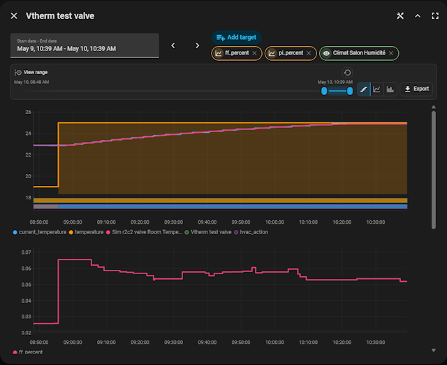
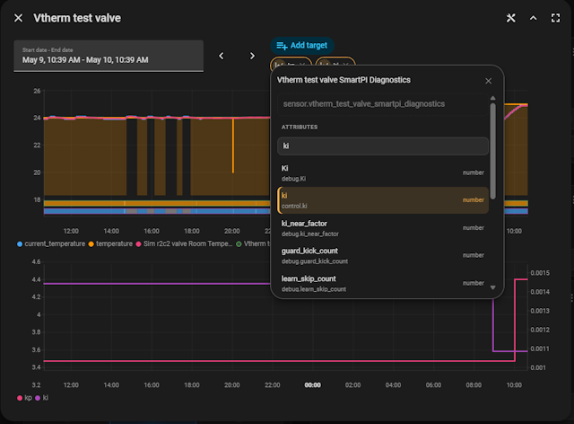

# ha-better-history

Author: @KipK

Standalone web component for Home Assistant history charts. Built with **Lit 3** and **TypeScript**. Renders SVG charts with no external charting dependencies.

**Status: WIP** — API not yet stable.

## Why ha-better-history?

`ha-better-history` keeps the familiar Home Assistant history-chart experience, but exposes it as a reusable web component with extra controls for dashboards, dialogs, and custom cards.

- **Familiar HA-style history UX, with more control** — time-series charts, legend toggles, tooltips, date ranges, and Home Assistant theming are kept close to the native experience while adding configuration and runtime tools.
- **Entity attributes as first-class series** — chart `entity.state` or any supported attribute path, including nested attributes. The picker can browse and search attributes, then add them directly to the chart.
- **Use only the chart or the full explorer** — render a minimal graph, enable just the date picker, or expose the complete viewer with tools, zoom, export, entity picker, and attribute picker.
- **No-refetch view tools** — zoom and pan inside the already loaded range without asking Home Assistant for the same history again.
- **Flexible rendering modes** — numeric series can be displayed as stair steps, straight lines, or columns, globally or per series.
- **Smarter multi-series layout** — automatic graph grouping by unit or explicit `scaleGroup`, optional manual Y ranges, dual-axis handling, and stable colors for readable comparison.
- **Climate-aware overlays** — when climate temperature and `hvac_action` are present, heating periods can be rendered as a contextual area overlay.
- **Runtime series editing** — users can add, remove, reorder, and hide non-default series from the UI without rebuilding the host card.
- **Portable export format** — visible data can be exported as compact `ha-better-history-series-v1` JSON for debugging, sharing, future analysis tools, or re-importing into the component.
- **Standalone integration surface** — the component can be embedded in Lovelace cards, dialogs, more-info style views, or any Home Assistant frontend context that can provide `hass`.

### Screenshots





## Quick start

```html
<ha-better-history></ha-better-history>

<script type="module" src="dist/define.js"></script>
<script>
  const chart = document.querySelector("ha-better-history");
  chart.hass = hass;                         // required: HomeAssistant instance
  chart.entities = ["sensor.temperature", "sensor.humidity"];
</script>
```

## Properties

All properties are camelCase in JS and kebab-case as HTML attributes (for boolean/string/number props). Object/complex props are JS-only (no attribute).

### Top-level attributes (HTML)

| Attribute            | Type      | Default     | Description                                                     |
| -------------------- | --------- | ----------- | --------------------------------------------------------------- |
| `hours`              | `number`  | `24`        | Time range in hours before `endDate`                            |
| `show-date-picker`   | `boolean` | `false`     | Show `ha-date-range-picker` above the chart                     |
| `show-entity-picker` | `boolean` | `false`     | Show entity picker + attribute browser                          |
| `show-import-button` | `boolean` | `false`     | Show a JSON import button in the tools panel                    |
| `show-legend`        | `boolean` | `true`      | Legend below the chart                                          |
| `show-tooltip`       | `boolean` | `true`      | Multi-series tooltip on hover                                   |
| `width`              | `string`  | `"100%"`    | CSS width of the component wrapper                              |
| `height`             | `string`  | —           | CSS height; if omitted, computed from graph count               |
| `line-mode`          | `string`  | `"stair"`   | Global numeric display mode: `"stair"`, `"line"`, or `"column"` |
| `line-width`         | `string`  | `"2.5"`     | Global SVG stroke width for numeric lines                       |
| `background-color`   | `string`  | transparent | CSS background color for the component wrapper                  |
| `graph-title`        | `string`  | —           | Optional title above the chart                                  |
| `title-font-family`  | `string`  | HA theme    | Optional title font-family override                             |
| `title-font-size`    | `string`  | HA theme    | Optional title font-size override                               |
| `title-color`        | `string`  | HA theme    | Optional title color override                                   |
| `language`           | `string`  | HA locale   | Language code for labels (`"en"`, `"fr"`, …)                    |
| `tools-open`         | `boolean` | `false`     | Open/close the viewer tools panel from outside                  |

### JS-only properties

| Property         | Type                  | Default     | Description                                   |
| ---------------- | --------------------- | ----------- | --------------------------------------------- |
| `hass`           | `HomeAssistant`       | —           | **Required.** The Home Assistant object       |
| `config`         | `BetterHistoryConfig` | `undefined` | Full declarative configuration                |
| `entities`       | `string[]`            | `undefined` | Shortcut: entity IDs to plot their `state`    |
| `startDate`      | `Date`                | `undefined` | Lower bound (overrides `hours`)               |
| `endDate`        | `Date`                | `undefined` | Upper bound (default: now)                    |
| `attributeUnits` | `AttributeUnitMap`    | `undefined` | Map from attribute dot-paths to display units |

If `endDate` is in the future, the component fetches and renders only up to the current time. The visible time axis then advances live until the requested end is reached, using current `hass.states` updates for entity and attribute points instead of refetching Home Assistant history for every update.

## `BetterHistoryConfig`

The `config` property accepts a `BetterHistoryConfig` object. Every field is optional — the component does something reasonable when nothing is provided.

```ts
interface BetterHistoryConfig {
  // Time window
  hours?: number;                    // default: 24
  startDate?: Date;
  endDate?: Date;

  // UI chrome
  showDatePicker?: boolean;          // default: false
  showEntityPicker?: boolean;        // default: false
  showImportButton?: boolean;        // default: false
  showLegend?: boolean;              // default: true
  showTooltip?: boolean;             // default: true
  width?: string;                    // default: "100%"
  height?: string;
  lineMode?: "stair" | "line" | "column"; // default: "stair"
  lineWidth?: number | string;       // default: "2.5"
  backgroundColor?: string;          // default: transparent
  title?: string;                    // omitted/empty = no title
  titleFontFamily?: string;          // default: HA/theme font
  titleFontSize?: string;            // default: HA/theme title size
  titleColor?: string;               // default: HA/theme text color

  // Data
  series?: SeriesConfig[];           // explicit series list
  defaultEntities?: string[];        // shown in entity picker when enabled
  disableClimateOverlay?: boolean;   // default: false

  // Attribute units
  attributeUnits?: AttributeUnitMap; // map attribute dot-paths to display units
}
```

### `SeriesConfig`

Each series describes what to plot and how it should be displayed.

```ts
interface SeriesConfig {
  entity: string;                    // Required: entity_id (e.g. "climate.living")
  attribute?: string | string[];     // Dotted path or array; omit = entity.state
  label?: string;                    // Legend label; default = friendly_name or attribute path
  color?: string;                    // CSS color; default = automatic palette
  unit?: string;                     // Override unit (for axis grouping and label)

  scaleGroup?: string;               // Series with same scaleGroup share a Y axis
  scaleMode?: "auto" | "manual";     // default: "auto"
  scaleMin?: number;                 // only when scaleMode = "manual"
  scaleMax?: number;                 // only when scaleMode = "manual"
  lineMode?: "stair" | "line" | "column"; // overrides global lineMode
  lineWidth?: number | string;       // overrides global lineWidth
}
```

## Attribute units

HA attributes have no native unit in history responses. Use `attributeUnits` to map attribute dot-paths to display units. This drives both axis grouping and label display.

```ts
history.attributeUnits = {
  "specific_states.ema_temperature": "temperature",
  "power_percent": "%"
};
```

Keys are dot-separated paths from `entity.attributes` (e.g. `"specific_states.ema_temperature"`). Matching is exact — no wildcards, no entity-id prefix. Values are the unit string to display.

Use the special value `"temperature"` for attributes that should use the active temperature unit. When a temperature graph exists, the component resolves it to the configured temperature unit such as `°C` or `°F`, so the attribute shares the same graph without hard-coding Celsius/Fahrenheit.

Unit resolution priority for a series:
1. `SeriesConfig.unit` (explicit, including empty string to suppress the unit)
2. `.attributeUnits` property
3. `config.attributeUnits`
4. `unit_of_measurement` for entity-state series
5. No unit

A numeric attribute with a temperature unit (`°C`, `°F`, `K`) is automatically placed in the same graph as other temperature series when a `group:temperature` group already exists. Likewise, attributes added via the entity picker receive their unit from the map before scale grouping is applied.

## Scale grouping rules

1. **Automatic (default)**: numeric series with the **same unit** share a graph and Y axis. Series with different units (or no unit) each get their own stacked graph. Non-numeric series (string/boolean) render as **colored segment ribbons** below the numeric graphs.

2. **Explicit `scaleGroup`**: series sharing a `scaleGroup` value share the same graph and Y axis regardless of unit. Un-grouped series continue to use rule 1 among themselves.

3. **`scaleMode: "manual"`**: locks the Y axis to `[scaleMin, scaleMax]`. If the series is in a shared scale group, the manual range takes priority: the axis is extended (never contracted) to accommodate the manual range.

## Colors

If `color` is not set, the built-in palette cycles through: `#ff9800`, `#42a5f5`, `#66bb6a`, `#ec407a`, `#ab47bc`, `#26a69a`.

## Line and title styling

Numeric series render as stair-step lines by default to match Home Assistant state history. Set `lineMode: "line"` globally, or per `SeriesConfig`, to connect points with straight segments. Set `lineMode: "column"` to render numeric values as time-span columns. `lineWidth` accepts an SVG stroke width such as `1.5`, `"2px"`, or `"0.18rem"` for line-based modes.

Use top-level HTML attributes for simple global styling:

```html
<ha-better-history
  graph-title="Living room"
  line-mode="line"
  line-width="2"
  background-color="transparent"
></ha-better-history>
```

Use `config` for per-series overrides:

```js
chart.config = {
  title: "Living room",
  titleFontSize: "18px",
  titleColor: "var(--primary-text-color)",
  lineMode: "stair",
  lineWidth: 2.5,
  series: [
    { entity: "climate.living", attribute: "current_temperature", lineMode: "line", lineWidth: 2 },
    { entity: "climate.living", attribute: "temperature", lineWidth: 3 }
  ]
};
```

## Events

All events bubble and are composed.

| Event                    | Detail                                             | When                                                          |
| ------------------------ | -------------------------------------------------- | ------------------------------------------------------------- |
| `range-changed`          | `{ startDate: Date, endDate: Date }`               | Date picker changes                                           |
| `view-range-changed`     | `{ start: Date, end: Date }`                       | Tools range zoom changes without refetching history           |
| `series-toggled`         | `{ id: string, hidden: boolean }`                  | Legend item clicked                                           |
| `series-added`           | `{ source: HistorySource }`                        | User adds a series via entity picker                          |
| `series-removed`         | `{ sourceId: string }`                             | User removes a non-default series                             |
| `series-reordered`       | `{ sourceIds: string[] }`                          | User drags selected source chips into a new order             |
| `data-imported`          | `{ start: Date, end: Date, seriesCount: number }`  | A `ha-better-history-series-v1` JSON file is imported         |
| `tooltip-changed`        | `{ time: number, values: TooltipValue[] } \| null` | Pointer moves over chart (useful for syncing multiple charts) |
| `picker-overlay-changed` | `{ open: boolean }`                                | Entity picker or attribute browser overlay opens/closes       |

Legend toggles only keep visible series in the automatic numeric Y scale. Hidden numeric series remain available in the legend, but no longer stretch the scale for the displayed curves.

On touch screens, the tooltip is anchored away from the active finger position so values stay readable while scrubbing the chart.

## Default behaviour (no config)

When both `config` and `entities` are undefined:

- If the element has an `entity` attribute/prop, its `state` is plotted.
- Otherwise, renders an empty slot.

When `entities` is a non-empty array:

- Plots `entity.state` for each entity ID.
- Range = 24 hours.
- Date/entity pickers OFF, legend ON, tooltip ON.

## Recipes

### Two sensors with shared temperature scale

```js
chart.config = {
  series: [
    { entity: "climate.living", attribute: "current_temperature", label: "Indoor",  scaleGroup: "temp" },
    { entity: "sensor.outdoor_temp",                              label: "Outdoor", scaleGroup: "temp" },
  ]
};
```

### Climate entity with heating area overlay

When a chart includes **both** `current_temperature` and `hvac_action` attributes from the **same** climate entity, the component automatically draws a semi-transparent area under the temperature line during `"heating"` periods.

```js
chart.config = {
  series: [
    { entity: "climate.living", attribute: "current_temperature", label: "Temperature", color: "#42a5f5" },
    { entity: "climate.living", attribute: "hvac_action",         label: "State" },
  ]
};
```

Disable with `disableClimateOverlay: true`.

### Manual Y axis range

```js
chart.config = {
  series: [
    { entity: "sensor.pressure", label: "Pressure", scaleMode: "manual", scaleMin: 960, scaleMax: 1040 }
  ]
};
```

### With date picker enabled

```html
<ha-better-history show-date-picker></ha-better-history>
<script>
  chart.addEventListener("range-changed", (e) => {
    console.log(e.detail.startDate, e.detail.endDate);
  });
</script>
```

### With entity picker enabled

```html
<ha-better-history show-entity-picker></ha-better-history>
<script>
  chart.config = {
    defaultEntities: ["climate.living", "sensor.outdoor_temp"],
    series: [
      { entity: "climate.living", attribute: "current_temperature", label: "Indoor" }
    ]
  };
</script>
```

The entity picker lets users browse entity attributes and add/remove series at runtime. The attribute browser includes a local search field that finds top-level attributes, nested dotted paths, and primitive values inside attribute dictionaries. Non-default series are removable via chip buttons. Selected source chips can be dragged to reorder user-added graphs without refetching history; the chip order previews while dragging and is restored if the drag is cancelled.

### Viewer tools

The viewer toolbar appears above the graph when `tools-open` is `true`. It includes:

- a time range selector that zooms inside the already loaded history range without refetching data;
- a display mode switch for stair, line, and column rendering;
- a JSON export button;
- an optional JSON import button when `show-import-button` or `config.showImportButton` is `true`.

Drag the highlighted range selection to pan the zoomed graph through the loaded period while keeping the same visible duration. A minimum drag target stays available even when the visible range is tiny, and the minimum zoom span adapts to the loaded range.

The panel has no built-in toggle button — visibility is fully controlled by the parent via the `tools-open` attribute (or `.toolsOpen` property). A typical integration adds a `mdi:tools` icon button in its own header and binds its state:

```html
<button @click=${() => this._toolsOpen = !this._toolsOpen}>tools</button>
<ha-better-history .toolsOpen=${this._toolsOpen}></ha-better-history>
```

Exports use the compact `ha-better-history-series-v1` format:

```json
{
  "format": "ha-better-history-series-v1",
  "exportedAt": "2026-05-07T13:24:00.000Z",
  "loadedRange": { "start": "2026-05-07T00:00:00.000Z", "end": "2026-05-07T12:00:00.000Z" },
  "viewRange": { "start": "2026-05-07T06:00:00.000Z", "end": "2026-05-07T09:00:00.000Z" },
  "series": [
    {
      "id": "attr:climate.living:current_temperature",
      "entityId": "climate.living",
      "attribute": "current_temperature",
      "label": "current_temperature",
      "unit": "°C",
      "valueType": "number",
      "lineMode": "stair",
      "color": "#42a5f5",
      "points": [{ "timestamp": "2026-05-07T06:00:00.000Z", "value": 19.5 }]
    }
  ]
}
```

The optional import button accepts the same `ha-better-history-series-v1` JSON. Imported files replace the current displayed series, apply the exported loaded range and view range, and render locally without querying Home Assistant history.

## CSS custom properties

Override these on the host element to customize appearance.

| Property                             | Fallback                  |
| ------------------------------------ | ------------------------- |
| `--better-history-bg`                | `--card-background-color` |
| `--better-history-text-color`        | `--primary-text-color`    |
| `--better-history-muted-color`       | `--secondary-text-color`  |
| `--better-history-border-color`      | `--divider-color`         |
| `--better-history-accent-color`      | `--accent-color`          |
| `--better-history-radius`            | `8px`                     |
| `--better-history-font-family`       | `inherit`                 |
| `--better-history-title-color`       | `--primary-text-color`    |
| `--better-history-title-font-family` | `inherit`                 |
| `--better-history-title-font-size`   | `--ha-font-size-xl, 20px` |

## Loading / setup

**Bundled** (recommended for production):

```js
// Auto-registers <ha-better-history>
import "ha-better-history/define";
```

**Manual register** (no side-effect import):

```js
import { HaBetterHistory } from "ha-better-history";
customElements.define("ha-better-history", HaBetterHistory);
```

**Date picker / entity picker** load their required HA components lazily via `@kipk/load-ha-components`. If `show-date-picker` or `show-entity-picker` is set, the component calls `ensureDateRangePicker()` / `ensureHaComponents()` on `connectedCallback`. These must run inside a Home Assistant frontend context (where `partial-panel-resolver` is available). In a standalone dev page, loading will fail gracefully after a 10-second timeout.

## Dev page

```bash
npm install
npm run dev
```

Opens a local Vite dev server with synthetic data. No HA instance needed. See `dev/index.html`.

## Release

Releases are created by pushing a version tag that matches `package.json` exactly:

```bash
npm version 1.0.0 --no-git-tag-version
git tag 1.0.0
git push origin maater --tags
```

Accepted tag formats are `1.0.0`, `1.0.0-rc1`, and `1.0.0-beta1`. Stable tags publish to the npm `latest` dist-tag; release candidates publish to `rc`; beta releases publish to `beta`.

The GitHub Action builds the package, uploads the npm tarball and browser `dist` archive to the GitHub Release, and publishes to npm through Trusted Publishing. Configure the package on npm with GitHub Actions as trusted publisher for `KipK/ha-better-history` and workflow filename `release.yml`; no `NPM_TOKEN` secret is required.
